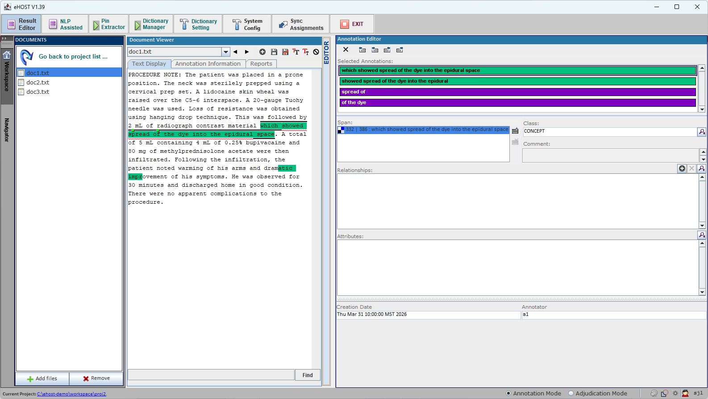
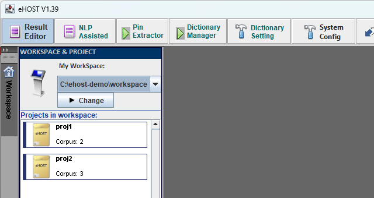
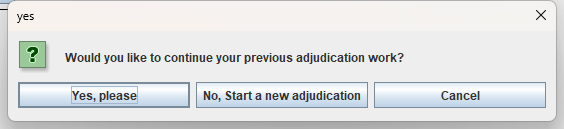
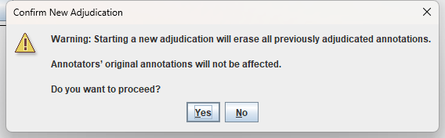
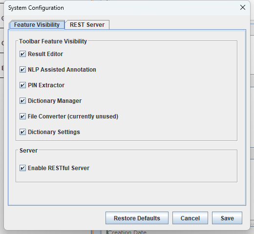

# eHOST — Extensible Human Oracle Suite of Tools

**eHOST** is an open source desktop application for **manually annotating text** and for turning
several annotators' work into a single, agreed-upon gold standard. It was originally built for
clinical and biomedical natural language processing, and it is still used mainly for building
reference standards for NLP systems.

This site documents the actively maintained fork at
[github.com/jianlins/ehost](https://github.com/jianlins/ehost), a rebuilt and extended version of the
[original eHOST](https://code.google.com/archive/p/ehost/). The current release is **1.39**.



New to eHOST? Start with [1.1 Prerequisites](wiki/1.1_Prerequisites.md) and work through section 1 —
it walks you from an empty folder to your first saved annotation.

---

## What eHOST does

| | |
|---|---|
| **Annotate** | Highlight spans of text and assign them a **class**, **attributes** (with controlled values), **relationships** between annotations, and free-text comments. Annotations are stored as [Knowtator](https://knowtator.sourceforge.net/) `.knowtator.xml` files next to your documents. |
| **Organize** | Documents live in **projects** inside a **workspace**. Each project keeps its own annotation schema, corpus, saved annotations, adjudication data and reports. |
| **Review** | Filter and curate annotations, generate annotation profiles and position-indicator graphs, run consistency/error checks, and use *Oracle* mode to find text that looks like what you have already annotated. |
| **Measure agreement** | Generate **IAA (inter-annotator agreement)** reports — precision, recall and F-measure per annotator pair, plus drill-down pages listing exactly which annotations matched and which did not. |
| **Adjudicate** | Step through disagreements in **Adjudication Mode** and accept, edit or reject each one to build a gold standard. Adjudication work is saved separately from the annotators' original files and can be paused and resumed. |
| **Automate** | [Pre-annotate with dictionaries](wiki/4.1-Generate-Pre-annotations-using-Custom-Dictionary.md) or [regular expressions](wiki/4.2-Generate-Pre-annotations-using-Regular-Expression.md), run the [ConText/NegEx algorithms](wiki/4.3-ConTEXT-algorithm.md), export annotations to Excel, and drive eHOST from a browser or script through its built-in [RESTful server](RESTful-Server-Guide.md). |

---

## A typical project



1. **Pick a workspace and create a project** — [1.3 Assign Workspace and Project](wiki/1.3_Assign_Workspace_and_Project.md)
2. **Load your documents** into the project corpus — [1.4 Load Documents](wiki/1.4_Load-Documents.md)
3. **Define the schema**: classes, attributes and relationships — [1.5.1 Define Classes](wiki/1.5.1_Define_Classes.md)
4. **Annotate** and save — [1.6 Create Annotations](wiki/1.6_Create_Annotations.md)
5. **Review and curate** what has been annotated — [3.1 Annotation Review and Curation](wiki/3.1-Annotation-Review-and-Curation.md)
6. **Measure agreement** between annotators — [3.5 IAA Reports](wiki/3.5-IAA-Report.md)
7. **Adjudicate** the disagreements into a gold standard — [3.6 Adjudication Mode](wiki/3.6-Adjudication-Mode.md)

Reports are generated from the **Reports** tab of the Document Viewer:


---

## Highlights in 1.39

See the [full change log](https://github.com/jianlins/ehost/blob/master/CHANGELOG.md) for details.

### Adjudication comparison inside IAA reports

If the project already contains adjudicated annotations, the IAA report automatically loads them as an
extra annotator called **Adjudication** and adds a section comparing every annotator against that gold
standard. Attributes are compared row by row, and differing values are highlighted.


More: [3.5 IAA Reports](wiki/3.5-IAA-Report.md)

### Adjudication you can pause, resume and restart safely

Adjudication state is stored in the project's `adjudication/` folder, so it survives closing eHOST.
Re-entering Adjudication Mode asks whether to continue, and starting over requires confirming an
explicit warning first.





eHOST also prompts you to save before switching between Annotation and Adjudication Mode, so mode
switches can no longer silently discard work.

More: [3.6.1 Resume or Restart Adjudication](wiki/3.6.1-Resume-or-Restart-Adjudication.md) ·
[3.6.2 Adjudication Data Storage](wiki/3.6.2-Adjudication-Data-Storage.md)


### Reports served over HTTP, for shared installations

Reports are opened through eHOST's own web server instead of `file://` URIs. Every link inside a report
is relative, so when several people share one eHOST installation each person's clicks drive their own
eHOST instance. A new **Open Report Folder...** button opens a report from any location on disk.

More: [3.7 Viewing and Sharing Reports](wiki/3.7-Viewing-and-Sharing-Reports.md) ·
[RESTful Server Guide](RESTful-Server-Guide.md)

### System Configuration dialog

Settings that used to require hand-editing `eHOST.sys` and `application.properties` can now be changed
from the toolbar's **System Config** button — which toolbar features are visible, whether the RESTful
server runs, and the server address, port and logging levels.



More: [2.8 System Configuration](wiki/2.8-System-Configuration.md)

---

## Quick start

**1. Install Java.** eHOST needs Java 8 or newer — see [1.1 Prerequisites](wiki/1.1_Prerequisites.md).

**2. Get eHOST.** Download `eHOST-<version>.zip` from the
[releases page](https://github.com/jianlins/ehost/releases) and unzip it anywhere.

**3. Run it.**

```bash
java -jar eHOST.jar
```

The bundled `run.bat` (Windows) and `run` (macOS/Linux) scripts do the same thing. You can also point
eHOST at a specific workspace or configuration folder:

```bash
java -jar eHOST.jar -w /path/to/workspace -c /path/to/config
```

See [1.2 Launching eHOST](wiki/1.2_Launching_eHost.md) for all command line options and for where eHOST
looks for its configuration files.

Building from source instead? eHOST is a Maven project that must be built with **JDK 8**:

```bash
bash script/mvn_install_jar.sh   # script\mvn_install_jar.bat on Windows
mvn clean package                # produces target/deploy/eHOST.jar
```

---

## Documentation

### 1. Installation and Quick Start
* [1.1 Prerequisites](wiki/1.1_Prerequisites.md)
* [1.2 Launching eHOST](wiki/1.2_Launching_eHost.md)
* [1.3 Assign Workspace and Project](wiki/1.3_Assign_Workspace_and_Project.md)
  * [1.3.1 Assign Workspace](wiki/1.3_Assign_Workspace_and_Project.md)
  * [1.3.2 Create a Project](wiki/1.3.2_Create_Project.md)
* [1.4 Load Documents](wiki/1.4_Load-Documents.md)
* [1.5 Create Annotation Schema](wiki/1.5.1_Define_Classes.md)
  * [1.5.1 Define Classes](wiki/1.5.1_Define_Classes.md)
  * [1.5.2 Define Attributes](wiki/1.5.2_Define_Attributes.md)
  * [1.5.3 Define Relationships](wiki/1.5.3_Define_Relationships.md)
* [1.6 Create Annotations](wiki/1.6_Create_Annotations.md)
  * [1.6.1 Create Class Annotation](wiki/1.6_Create_Annotations.md)
  * [1.6.2 Assign Attribute](wiki/1.6.2_Assign_Attribute.md)
  * [1.6.3 Create Relationship](wiki/1.6.3-Create-Relationship.md)
* [1.7 Save Annotations](wiki/1.7-Save-Annotations.md)

### 2. Basic Features
* [2.1 Workspace and Project](wiki/2-Basic-Features.md)
* [2.2 Viewer](wiki/2.2-Viewer.md)
* [2.3 Editor](wiki/2.3-Editor.md)
* [2.4 Import Annotations](wiki/2.4-Import-Annotations.md)
* 2.5 Annotation Operations
  * [2.5.1 Add/Delete/Modify Annotations](wiki/2.5-Add-Delete-Modify-Annotations,-Class,-Attributes-and-Relationships.md)
  * [2.5.2 Add/Delete/Modify Class](wiki/2.5.2-Add-Delete-Modify-Class.md)
  * [2.5.3 Add/Delete/Modify Attributes and Values](wiki/2.5.3-Add-Delete-Modify-Attributes-and-Values.md)
  * [2.5.4 Add/Delete/Modify Relationship](wiki/2.5.4-Add-Delete-Modify-Relationships.md)
* [2.6 Assign Annotator](wiki/2.6-Assign-Annotator.md)
* [2.7 Save Annotations](wiki/2.7-Save-Annotations.md)
* [2.8 System Configuration](wiki/2.8-System-Configuration.md)

### 3. Advanced Features
* [3.1 Annotation Review and Curation](wiki/3.1-Annotation-Review-and-Curation.md)
* [3.2 Annotation Profile](wiki/3.2-Annotation-Profile.md)
  * [3.2.1 Generating Graph of Position Indicated](wiki/3.2.1-Generating-Graph-Reports-of-Position-Indicated.md)
* [3.3 Error Checking](wiki/3.3-Error-Checking.md)
* [3.4 Oracle (Annotations Like Me)](wiki/3.4-Oracle-Mode.md)
* [3.5 IAA Reports](wiki/3.5-IAA-Report.md)
* [3.6 Adjudication Mode](wiki/3.6-Adjudication-Mode.md)
  * [3.6.1 Resume or Restart Adjudication](wiki/3.6.1-Resume-or-Restart-Adjudication.md)
  * [3.6.2 Adjudication Data Storage](wiki/3.6.2-Adjudication-Data-Storage.md)
* [3.7 Viewing and Sharing Reports](wiki/3.7-Viewing-and-Sharing-Reports.md)

### 4. Beyond Manual Annotation
* [4.1 Generate Pre-annotations using Custom Dictionary](wiki/4.1-Generate-Pre-annotations-using-Custom-Dictionary.md)
* [4.2 Generate Pre-annotations using Regular Expression](wiki/4.2-Generate-Pre-annotations-using-Regular-Expression.md)
* [4.3 ConTEXT algorithm](wiki/4.3-ConTEXT-algorithm.md)

### [5. Glossary](wiki/5-Glossary.md)

### Reference
* [RESTful Server Guide](RESTful-Server-Guide.md) — endpoints, port selection and multi-user deployment
* [Change log](https://github.com/jianlins/ehost/blob/master/CHANGELOG.md)
* [Glossary](wiki/5-Glossary.md)
* [Source code and issue tracker](https://github.com/jianlins/ehost)
