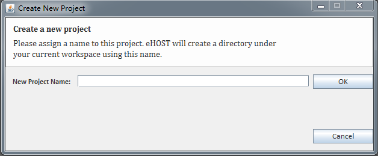
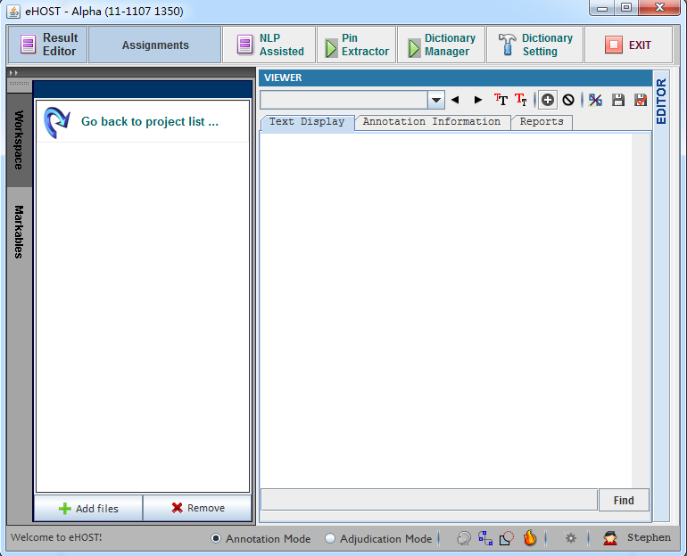

### 1.3.2 Create Project ###

1) Click 

2) Type in a name for the annotation project and click OK.

3) Double Click to open new project.

[^1]: Many of these instructions were based on https://github.com/chrisleng/ehost/wiki