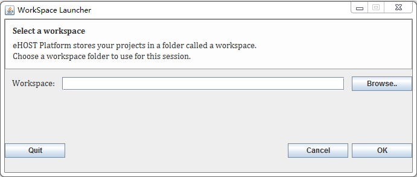

## 1.3 Assign Workspace and Project ##

### 1.3.1 Assign Workspace ###
 1. Click "Browser" button to find and select workspace. Then Click OK.

[^1]: Many of these instructions were based on https://github.com/chrisleng/ehost/wiki