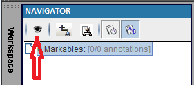
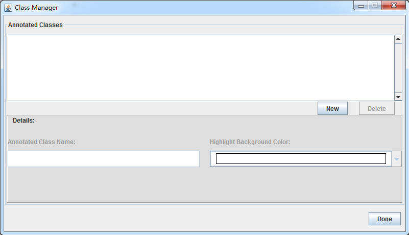
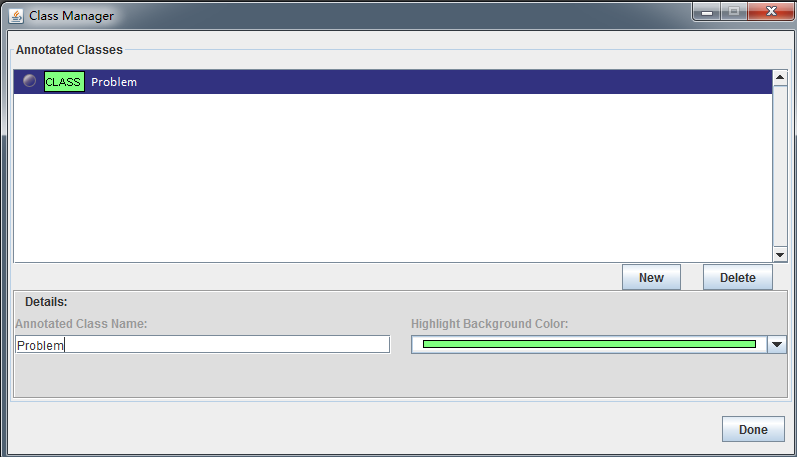
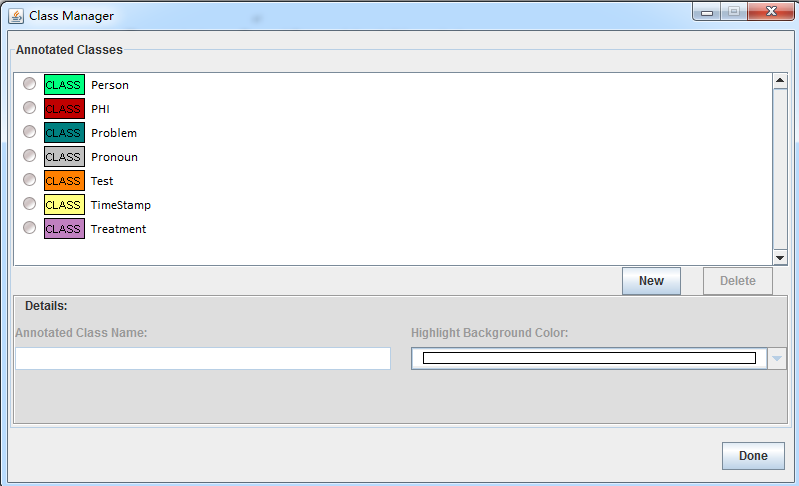

## 1.5 Create Annotation Schema ##
### 1.5.1 Define Classes ###

1. Click on Markables (The darker one)

   

2. Click on the icon  to open Class Manager. 

   

   You will see the dialog of "Class Manager" pop up

   
 

3. Click on button of  to  enter "Problem" for the new class, and select color from drop-down list.

   

4. Repeat steps 2 and 3 to add additional classes.

   

5. Click when finished. 

   

[^1]: Many of these instructions were based on https://github.com/chrisleng/ehost/wiki
