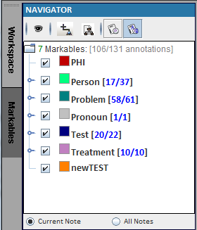
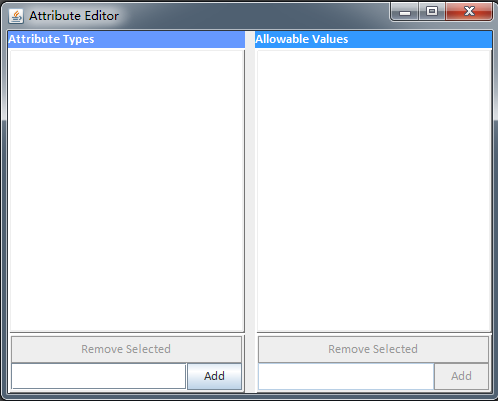
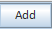
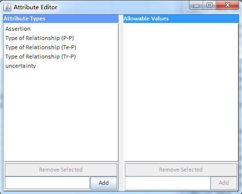
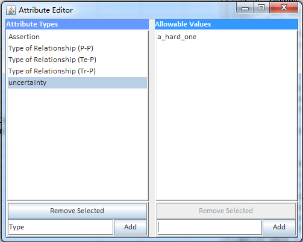

### 1.5.2 Define Attributes ###

1. Click on Markables (The darker one)

   

2. Click on the icon  to manage attributes. This displays the "Attributes Editor" window.

   

 

3. Enter "Assertion" to the Attribute Type then  to save.

   

4. Select assertion and type "conditional" as value then click  to save.

   

5. Repeat steps 3 and 4 to add additional attributes type and values.

   

