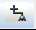
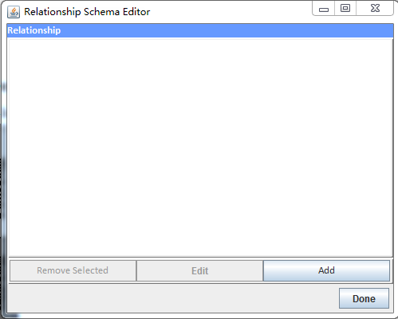
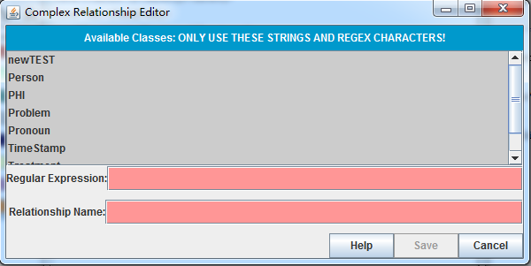
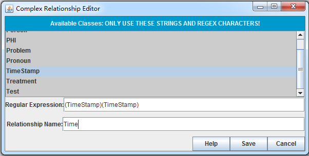
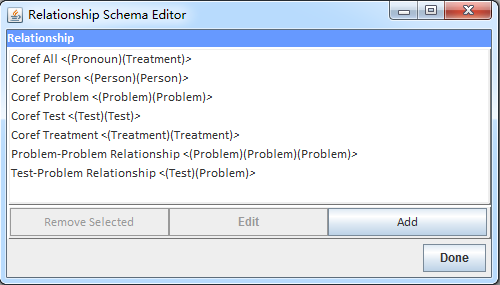

### 1.5.3 Define Relationships ### 

1. Click on Markables (The darker one)

   
 

2. Click on the icon  to manage annotation classes.at the upper-left. This displays the "Relationship Schema Editor" window.

   

3. Click on "Add" to add new relationship. This displays the "Complex Relationship Editor" window.

   
 

4. Enter the "(TimeStamp)(TimeStamp)" to the Regular Expression and "Time" to the relationship name, then click Save

   

5. Repeat steps 3 and 4 to add additional relationships.

   

[^1]: Many of these instructions were based on https://github.com/chrisleng/ehost/wiki

 

