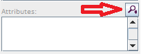
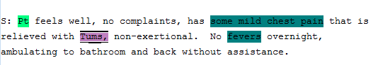
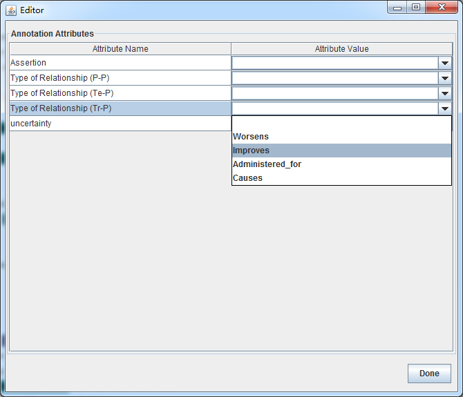

### 1.6.2	Assign Attribute

1.  Select "extensive work" then click  under the Attributes tab at the right side EDITOR Panel. 

    

    

2. Select an attribute Name and pickup an attribute value, then press "Done".

   

