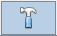
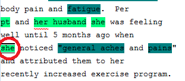
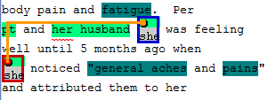

### 1.6.3 Create Relationship ### 

1. Click 

   

   in the left pane to start create relationship.

2. Left click “CMP” as the first annotation picked up.

   

3. Right click “UA” as the second annotation to make a relationship.

 

4. Repeat 2, 3 to create more relationships.
[^1]: Many of these instructions were based on https://github.com/chrisleng/ehost/wiki
