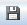
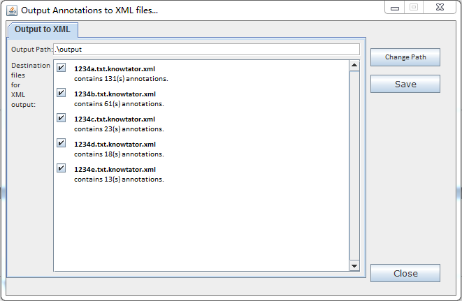

## 1.7 Save Annotations ##

* Click  to quick save for the annotations to the “saved” folder in the project folder.
* Click  to export all annotations to Knowtator XML files to a designated folder.

   
