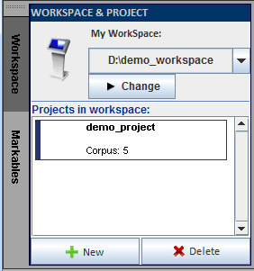
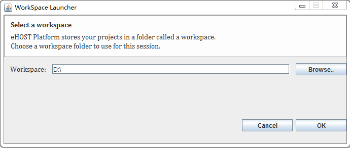
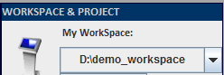
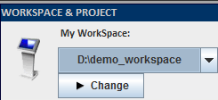
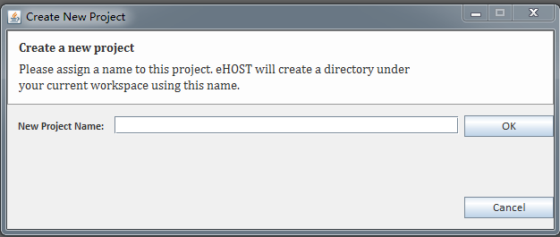

# 2 Basic Features
## 2.1	Workspace and Project

*  Different annotation tasks and projects are accessed via Workspace and Project panel in eHOST. User could switch between two most recent workspace paths. There could be multiple projects within each workspace. This allows user to easily switch between different annotation projects.

   

### 2.1.1 Change WorkSpace

1. Click  

   button. Then it displays the “WorkSpace Launcher” Window.
 
    

2. Click   button to find and select the workspace. Then click OK.

### 2.1.2	Switch WorkSpace

*  Click   button in 

     

   to select the existing workspace .

**Or**

*  Click  button in 

    

   to change another workspace. After that, the new work space's path will store in the existing work space history.

### 2.1.3	Create Project

1. Click   button.

2. Type in a name and click OK.
    

