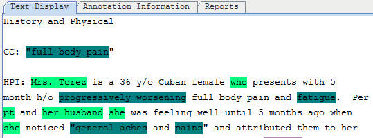
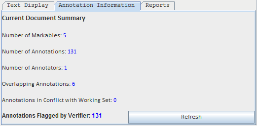
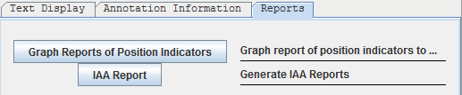

## 2.2 Viewer
 

* a) Filename of current file in Text Display tab.

   

* b) Drop-down menu to select the file to be displayed. 
* c) Move to the previous or next note. You can also use the keyboard shortcuts
  **Ctrl+PageUp** (previous note) and **Ctrl+PageDown** (next note). They work
  anywhere in the eHOST window — you do not need to click the Text Display area
  first, and they keep working after you select an annotation or edit in the
  Annotation Editor.
* d) Increase/ decrease text font. 
* e) Import annotations from Knowtator XML or PINS files.
* f) Remove all annotations.
* g) Check duplicated annotations and annotations with no span/ class . 
* h) Quick Save for the annotations to the “saved” folder in the project folder.
* i) “Save As”, export all annotations to Knowtator XML files to a designated folder. 
* j) Displaying the current text file.

   

* k) Displaying the document summary for the current text file. 

   

* l) Generating Position Indicators report and IAA Report. 

   
