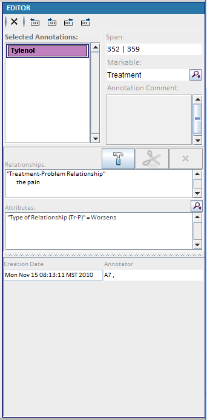

2.3 Editor [^1]

   

* a)	Delete the selected annotations
* b)	Move the start of the annotation one character to the left. 
* c)	Move the start of the annotation one character to the right. 
* d)	Move the end of the annotation one character to the left.
* e)	Move the end of the annotation one character to the right. 
* f)	Show the span for the current annotation
* g)	The markable for the current annotation. Click to modify the markable. 
* h)	Enable or disable the relationship building.
* i)	Edit selected relationship 
* j)	Delete selected relationship
* k)	Assigned attributes for the selected annotation.

[^1]: Many of these instructions were based on https://github.com/chrisleng/ehost/wiki
