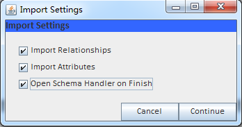
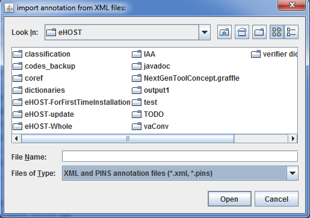
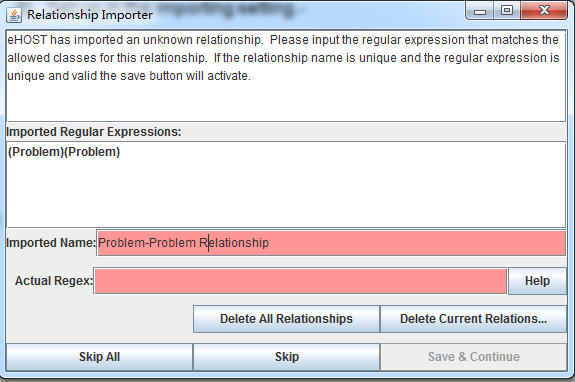

## 2.4 Import Annotations [^1]

1. Click  in the view panel to import annotations.

2. Set up in the importing setting.

   

3. Use the file browser to pick up the files.

   

4. The “Relationship Importer” window displays.

   

5. Use “Delete All Relationships” or “Delete Current Relations” to select the new relationships.

* **White**: regular expression is good and matches all imported relationships
* **Yellow**: valid regular expression, but doesn’t contain all imported relationships.
* **Red**: regular expression does not fit within guideline.

6. Done.

   

[^1]: Many of these instructions were based on https://github.com/chrisleng/ehost/wiki
 

