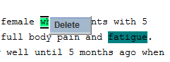

## 2.5 Add/Delete/Modify Annotations, Class, Attributes and Relationships

### 2.5.1 Add/Delete/Modify Annotations

**2.5.1.1 Add Annotations**

Please check **[1.6.1](1.6_Create_Annotations.md)**

**2.5.1.2 Delete Annotations**
1. Right Click and Select the annotations

   

2. Click “Delete”  to delete the annotation

Or

1. Selected the annotaiton.

2. Click  to delete the annotation.

**2.5.1.3	Modify Annotations**

1)Delete the annotation and create a new annotation

Or

1. Select the annotation

2. Use  to extend or shrink the annotation string.

[^1]: Many of these instructions were based on https://github.com/chrisleng/ehost/wiki

