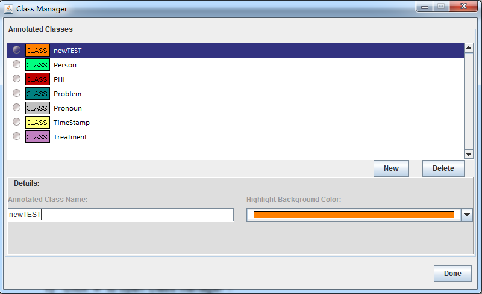

### 2.5.2 Add/Delete/Modify Class [^1]
**2.5.2.1	Add Class**
Check **[1.5.1](1.5.1_Define_Classes.md)**

**2.5.2.2	Delete Class**
1. Click  to open Class Manager

2. Select the Class

3. Click “Delete” to delete the class

**2.5.2.3	Modify Class**
1. Click  to open Class Manager

2. Select the Class

   

3. Type the new Name and Change the Background Color

4. Click Done.

[^1]: Many of these instructions were based on https://github.com/chrisleng/ehost/wiki

