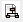
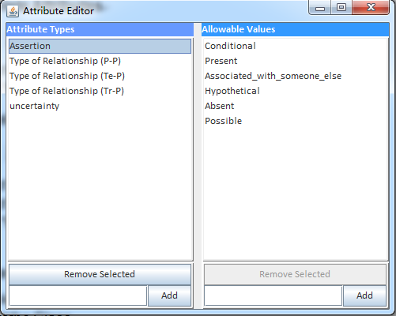
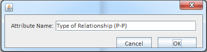

### 2.5.3 Add/Delete/Modify Attributes and Values
**2.5.3.1	Add Attributes and Values**
Check **[1.6.2](1.6.2_Assign_Attribute.md)**

**2.5.3.2 Delete Attributes**
1. Click  to open Attribute Editor

2. Select the Attribute

3. Click “Remove Selected”

**2.5.3.3 Delete Value**
1. Click  to open Attribute Editor

2. Select the Attribute

3. Select the Value

4. Click “Remove Selected”

   

**2.5.3.4	Modify Attributes**
1. Double Click the Attribute

   

2. Click “OK” to save the name.

