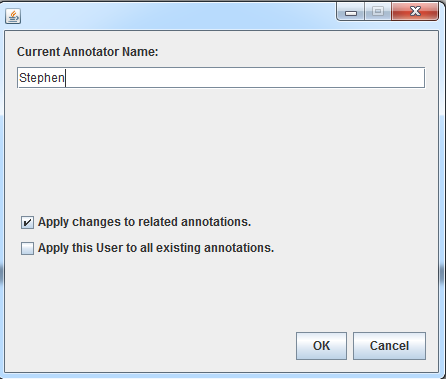

## 2.6 Assign Annotator [^1]

1. Double Click  to open the window.

2. Type in the name.

   

3. Click “OK” to be done.
[^1]: Many of these instructions were based on https://github.com/chrisleng/ehost/wiki
 

 

