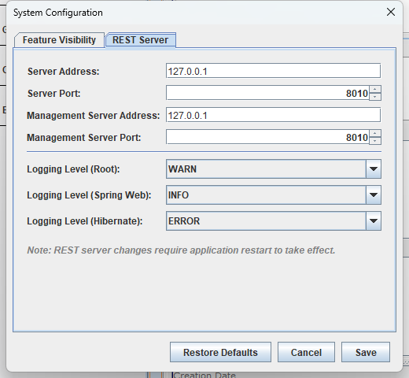

## 2.8 System Configuration

Most of eHOST's application-level settings live in two files:

| File | Contains |
|---|---|
| `eHOST.sys` | eHOST's own settings — annotator name, workspace path, which toolbar features are visible, whether the RESTful server is enabled, whether the legacy *Sync Assignments* button is shown, how annotation attributes are listed |
| `application.properties` | Settings for the built-in web server — address, port and logging levels |

Since version 1.39 you no longer have to edit these files by hand. Click **System Config** in the
toolbar to open the *System Configuration* dialog.

### Feature Visibility tab

The checkboxes under **Toolbar Feature Visibility** control which buttons appear in the main toolbar.
Turning off features you do not use keeps the toolbar short and avoids confusing annotators.

| Checkbox | Toolbar button |
|---|---|
| Result Editor | Result Editor |
| NLP Assisted Annotation | NLP Assisted |
| PIN Extractor | Pin Extractor |
| Dictionary Manager | Dictionary Manager |
| File Converter (currently unused) | Converter |
| Dictionary Settings | Dictionary Setting |

Internally these six checkboxes are the six digits of the `[MASK]` parameter in `eHOST.sys`.

**Enable RESTful Server** corresponds to the `[RESTFUL_SERVER]` parameter. It controls whether eHOST
starts its built-in web server, which is what makes browser navigation and HTTP report serving work
(see [3.7 Viewing and Sharing Reports](3.7-Viewing-and-Sharing-Reports.md) and the
[RESTful Server Guide](../RESTful-Server-Guide.md)).

**Show Sync Assignments (legacy VA Annotation Admin, unsupported)** corresponds to the
`[SYNC_ASSIGNMENTS]` parameter and is **off by default**. It shows the old *Sync Assignments* toolbar
button, which downloads annotation assignments from a VA VINCI *Annotation Admin* server and uploads
finished annotations back to it. That server is not part of eHOST and is not publicly available, and
the eHOST side of the integration was never finished, so leave this off unless your site actually runs
an Annotation Admin server. Background and the plan for this feature:
[Sync Assignments disabled by default](../enhancements/010-sync-assignments-disabled-by-default.md).

Toolbar changes take effect as soon as you click **Save**.

### REST Server tab

| Setting | Property | Default |
|---|---|---|
| Server Address | `server.address` | `127.0.0.1` |
| Server Port | `server.port` | `8010` |
| Management Server Address | `management.server.address` | `127.0.0.1` |
| Management Server Port | `management.server.port` | `8010` |
| Logging Level (Root) | `logging.level.root` | `WARN` |
| Logging Level (Spring Web) | `logging.level.org.springframework.web` | `INFO` |
| Logging Level (Hibernate) | `logging.level.org.hibernate` | `ERROR` |

Logging levels can be set to `ERROR`, `WARN`, `INFO` or `DEBUG`. Raising them to `DEBUG` is useful when
troubleshooting report serving or browser navigation.

Address and port changes are written to `application.properties` but the server keeps running on the
old port until eHOST is restarted; the dialog reminds you of this with a *Restart Required* message
after saving.

### Annotation Display tab

This tab controls how the **Attributes** list of an annotation is presented, both on the annotation
editor panel and on the side-by-side comparison panel used in adjudication mode.

| Setting | Parameter | Default |
|---|---|---|
| Order attributes by | `[ATTRIBUTE_DISPLAY_ORDER]` | `SCHEMA` |
| Highlight values that differ between the two annotations | `[HIGHLIGHT_ATTRIBUTE_DIFFERENCES]` | `true` |

**Order attributes by** decides the order of the rows:

| Choice | Stored as | Meaning |
|---|---|---|
| Schema order (as in the schema file) | `SCHEMA` | Inherited public attributes first, then the private attributes of the annotation class in the order they were defined in the schema. Attributes that are not in the schema come last, alphabetically. |
| Attribute name (A to Z) | `NAME` | Alphabetically by attribute name. This order is also used by the *Annotation Attributes* editor dialog. |
| As stored in the file (no sorting) | `UNSORTED` | The order the attributes were read from the `.knowtator.xml` file — how eHOST behaved before version 1.40. |

Annotation files written by different annotators rarely store the attributes in the same order, so
without sorting the two lists shown side by side do not line up. Sorting them makes the comparison
readable.

**Highlight values that differ between the two annotations** paints in bold dark red the
attributes whose value on the editor panel is not the value of the annotation currently selected on
the comparison panel. An attribute that only one of the two annotators filled in is highlighted too;
empty and missing values count as the same.

Both settings take effect as soon as you click **Save**.

### Buttons

| Button | Effect |
|---|---|
| **Save** | Writes `eHOST.sys` and `application.properties`, refreshes the toolbar, and reloads eHOST's cached configuration |
| **Cancel** | Closes the dialog without changing anything |
| **Restore Defaults** | Resets every field in the dialog to eHOST's defaults — nothing is written until you also click **Save** |

### Where the files are

eHOST looks for `eHOST.sys` and `application.properties` in the configuration home directory, which is
the folder given by `-c=` on the command line, or `USER_HOME/.ehost/` when `-c=` is not given. Either
file is created there from eHOST's bundled defaults if it does not exist yet. (`-s=` overrides the
location of `application.properties` alone.) See [1.2 Launching eHOST](1.2_Launching_eHost.md).

The dialog always edits the files in the configuration home that the running instance actually loaded,
so it is also the safest way to be sure you are editing the right copy.
