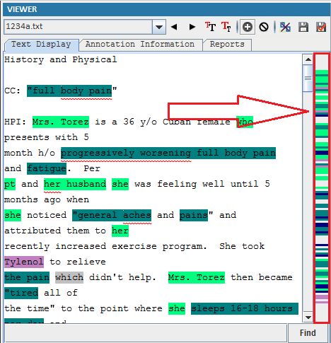

## 3.2 Annotation Profile [^1]
For each annotation file, there is a color bar on the right side of the Viewer.

[^1]: Many of these instructions were based on https://github.com/chrisleng/ehost/wiki

