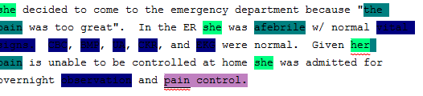
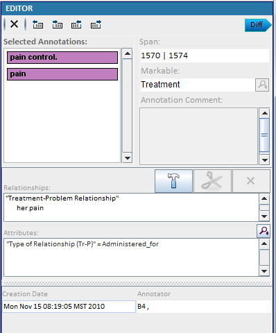
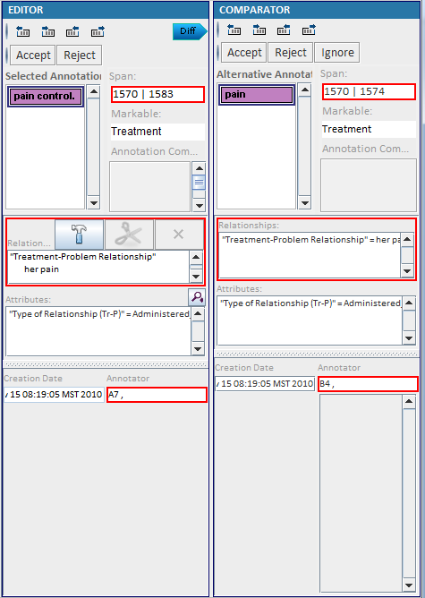

## 3.3 Error Checking
When some errors happen, there will be a red wave under the annotations.

   

1. Select "pain control"

2. Click  in the Editor Panel

   

3. Compare both annotations.

   

4. Click "Accept" or "Reject" to fix the error.

