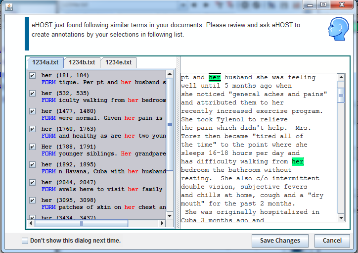

## 3.4 Oracle Mode (Annotations Like Me)
Oracle mode makes you easy to assign the same word in the project with the same class.

1. Click 

    

   at the bottom right to make sure the Oracle mode is on. (on for Blue, off for gray)

   

2. Mark "her" as Person"

3. Oracle mode window will pop out.

   

4. Select the ones with the same class. Click Save Changes to assign all "her" to "person".

