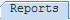
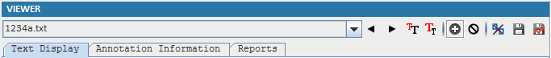
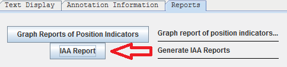
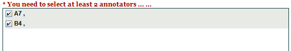
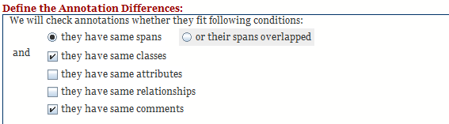
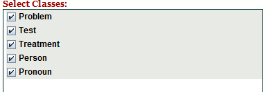
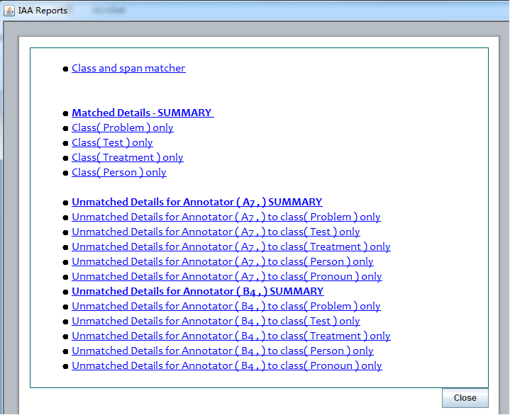

## 3.5 IAA Report
1. Click  in Viewer.

   

2. Click "IAA Report" to generate IAA Reports

   

3. Select Annotations by Annotator and then click Next

   

4. Define what are matches or non-matches
 
   

5. Select Class

   

6. Click Generate Report to complete the processing

   

### Reading the Report

The generated report is a set of linked HTML pages. The index page lists:

* **Class and span matcher** - pairwise and N-way agreement tables (precision, recall, F-measure)
* **Matched Details - SUMMARY** - annotations the annotators agreed on
* **Unmatched Details for <Annotator> - SUMMARY** - annotations only one annotator created

#### Attribute Comparison

In the matched and unmatched detail pages, every annotation attribute is shown on its **own row** so that
values can be compared annotator by annotator:

| | Annotator: A | Annotator: B |
|---|---|---|
| Class | Medication | Medication |
| &nbsp;&nbsp;Dosage | 10mg | 20mg |
| &nbsp;&nbsp;Route | oral | |

* Attribute rows are indented so they are easy to tell apart from the class-level rows
  (Class, Span, Annotation Text).
* A cell that is **empty with a gray background** means that annotator's annotation does not have
  that attribute at all.
* A value that differs between annotators is **highlighted in red**.

### Adjudication Comparison

If the project already contains adjudicated annotations (i.e. `.knowtator.xml` files exist in the
project's `adjudication/` folder), the IAA report automatically loads them as an extra annotator named
**Adjudication** and adds a highlighted **Adjudication Comparison** section to the index:

* Each annotator vs. Adjudication - unmatched summary
* Adjudication vs. all annotators - unmatched summary
* Per-class breakdowns of the unmatched details
* The pairwise and N-way agreement tables also include Adjudication

This lets you measure each annotator against the agreed-upon gold standard, not just against the other
annotators. No extra configuration is needed - simply adjudicate first (see
[3.6 Adjudication Mode](3.6-Adjudication-Mode.md)), save, and then
generate the IAA report.

### Opening the Report

Reports are served through eHOST's built-in web server so that they work correctly when several people
share one eHOST installation. See
[3.7 Viewing and Sharing Reports](3.7-Viewing-and-Sharing-Reports.md).

[^1]: Many of these instructions were based on https://github.com/chrisleng/ehost/wiki

