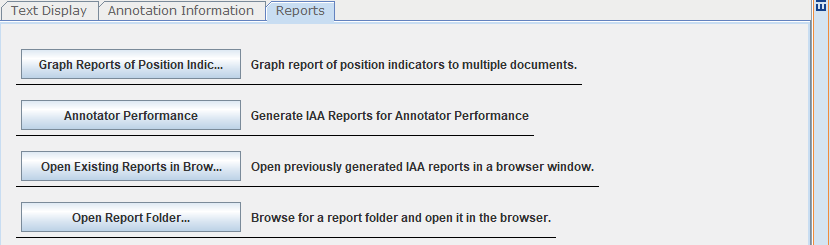
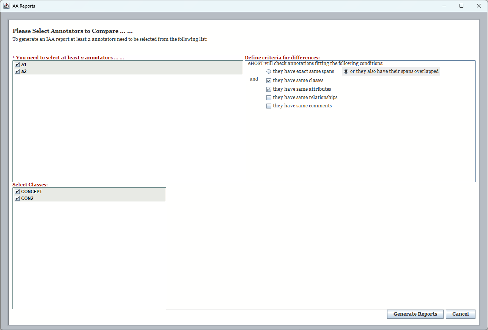
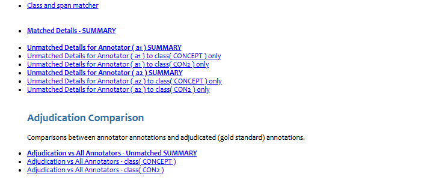
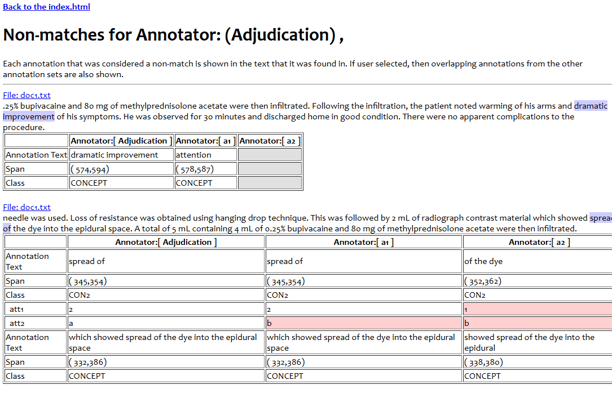

## 3.5 IAA Report

An **IAA (inter-annotator agreement)** report tells you how much two or more annotators agree, and
exactly where they do not. It is the usual first step before adjudication.

### Generating a report

1. Open a project, then select the **Reports** tab in the Document Viewer.

   

2. Click **Annotator Performance**. The *IAA Reports* dialog opens.

   

3. Fill in the dialog:

   | Area | What to do |
   |---|---|
   | **You need to select at least 2 annotators** | Tick the annotators to compare. Every annotator that has saved annotations in the project is listed. |
   | **Define criteria for differences** | Choose whether spans must match *exactly* or may simply *overlap*, and which of class, attributes, relationships and comments must also match for two annotations to count as agreeing. |
   | **Select Classes** | Tick the annotation classes to include. Per-class detail pages are produced for each selected class. |

4. Click **Generate Reports**. eHOST writes the HTML report into the project's `reports` folder and
   shows the report index.

   

### Reading the report

The generated report is a set of linked HTML pages. The index page lists:

* **Class and span matcher** — pairwise and N-way agreement tables (precision, recall, F-measure)
* **Matched Details - SUMMARY** — annotations the annotators agreed on
* **Unmatched Details for &lt;Annotator&gt; - SUMMARY** — annotations only one annotator created,
  plus a per-class page for each selected class

Each unmatched entry shows the surrounding sentence with the annotation highlighted, followed by a
table comparing that annotation across annotators. File names are links: clicking one jumps your
running eHOST to that document (see [3.7 Viewing and Sharing Reports](3.7-Viewing-and-Sharing-Reports.md)).

#### Attribute comparison

In the matched and unmatched detail pages, every annotation attribute is shown on its **own row** so that
values can be compared annotator by annotator:

| | Annotator: A | Annotator: B |
|---|---|---|
| Class | Medication | Medication |
| &nbsp;&nbsp;Dosage | 10mg | 20mg |
| &nbsp;&nbsp;Route | oral | |

* Attribute rows are indented so they are easy to tell apart from the class-level rows
  (Class, Span, Annotation Text).
* A cell that is **empty with a gray background** means that annotator's annotation does not have
  that attribute at all.
* A value that differs between annotators is **highlighted in red**.

### Adjudication Comparison

If the project already contains adjudicated annotations (i.e. `.knowtator.xml` files exist in the
project's `adjudication/` folder), the IAA report automatically loads them as an extra annotator named
**Adjudication** and adds a highlighted **Adjudication Comparison** section to the index:

* Each annotator vs. Adjudication - unmatched summary
* Adjudication vs. all annotators - unmatched summary
* Per-class breakdowns of the unmatched details
* The pairwise and N-way agreement tables also include Adjudication

This lets you measure each annotator against the agreed-upon gold standard, not just against the other
annotators. No extra configuration is needed - simply adjudicate first (see
[3.6 Adjudication Mode](3.6-Adjudication-Mode.md)), save, and then
generate the IAA report.

### Opening the Report

Reports are served through eHOST's built-in web server so that they work correctly when several people
share one eHOST installation. Use **Open Existing Reports in Browser** to reopen the current project's
report later, or **Open Report Folder...** to open a report stored somewhere else. See
[3.7 Viewing and Sharing Reports](3.7-Viewing-and-Sharing-Reports.md).
