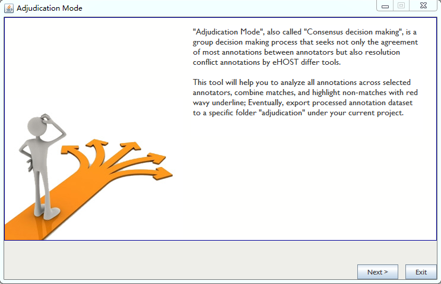
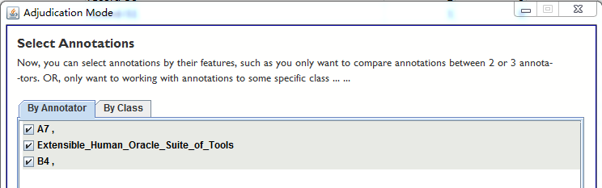
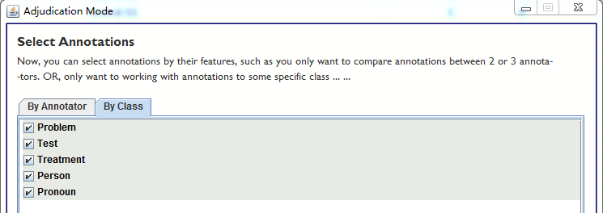
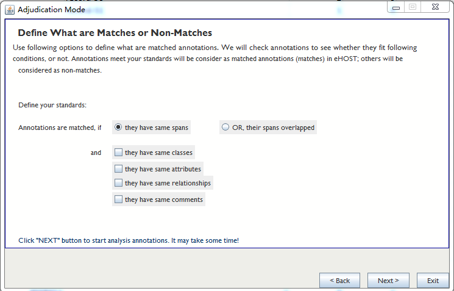
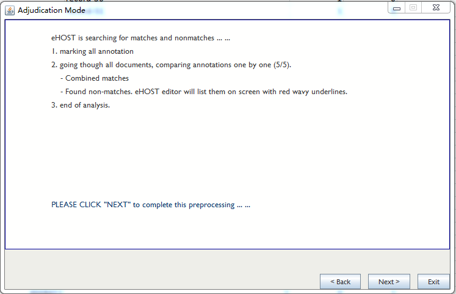
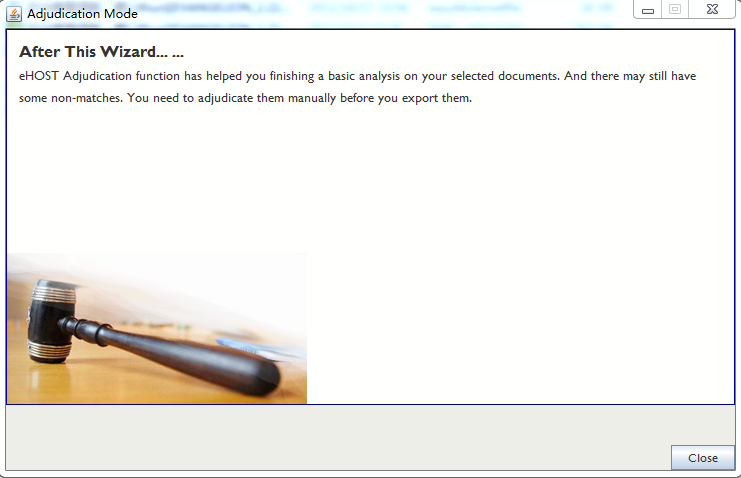
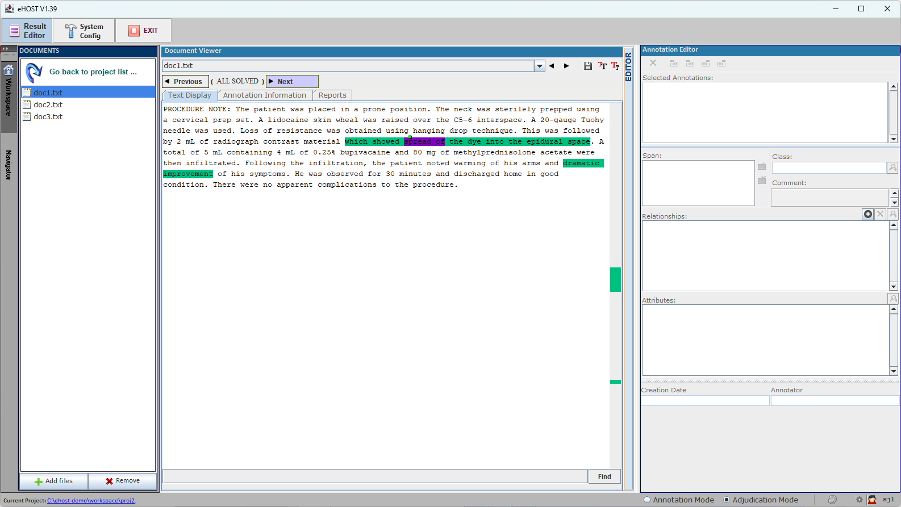

## 3.6	Adjudication Mode
1. Click the right-bottom to select Adjudication Mode to turn on the Adjudication Mode

   

2. Then you will get a pop window like this below: Click Next

   

3. Select Annotations by Annotator and then click Next

   

   Or Select Annotations by Class and then click Next

   

4. Define what are matches or non-matches

   

5. Click Next to complete the processing

   

6. Done.

   

### Working in Adjudication Mode

Once the wizard finishes, the main window switches to its adjudication layout:

* The toolbar is reduced to the buttons that make sense while adjudicating.
* A **Previous / Next** bar appears above the document tabs and walks you through the items that still
  need a decision. The counter between the two buttons shows your position, and reads
  `( ALL SOLVED )` once nothing is left in the current document.
* In the text, annotations keep the colour of their class, exactly as in annotation mode (the green and
  magenta spans above are two different classes, not two decisions). The items that still need a
  decision are marked with a **red wavy underline**.
* Use the Annotation Editor on the right to accept, edit or delete the annotation under review, exactly
  as in annotation mode.
* The mode selector at the bottom right of the window switches between **Annotation Mode** and
  **Adjudication Mode**.

### Switching Between Annotation and Adjudication Mode

eHOST keeps annotation work and adjudication work in separate folders, and adjudication work is only
written when you save while in adjudication mode. To prevent losing work, eHOST prompts you before a
mode switch:

* **Annotation mode -> Adjudication mode**: if you have unsaved annotation changes, eHOST asks
  *"Do you want to save your annotation work before switching to adjudication mode?"*
* **Adjudication mode -> Annotation mode**: if you have made changes while adjudicating, eHOST asks
  *"Do you want to save your adjudication work before switching to annotation mode?"*

The prompt only appears when something has actually changed, so simply switching back and forth without
editing will not interrupt you. Clicking the Save button in either mode clears both pending-change
flags, and closing eHOST also checks for unsaved adjudication work.

### Resuming or Restarting Adjudication

If adjudication files already exist for the project, eHOST offers three choices when you enter
adjudication mode. See
[3.6.1 Resume or Restart Adjudication](3.6.1-Resume-or-Restart-Adjudication.md).

### Where Adjudication Data Is Stored

See [3.6.2 Adjudication Data Storage](3.6.2-Adjudication-Data-Storage.md)
for the layout of the `saved/` and `adjudication/` folders.
