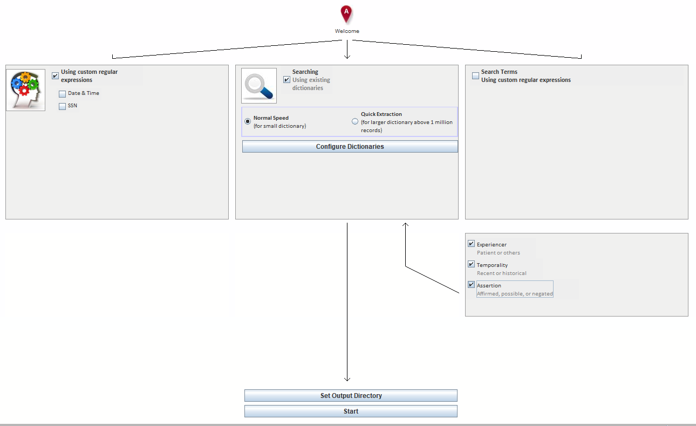
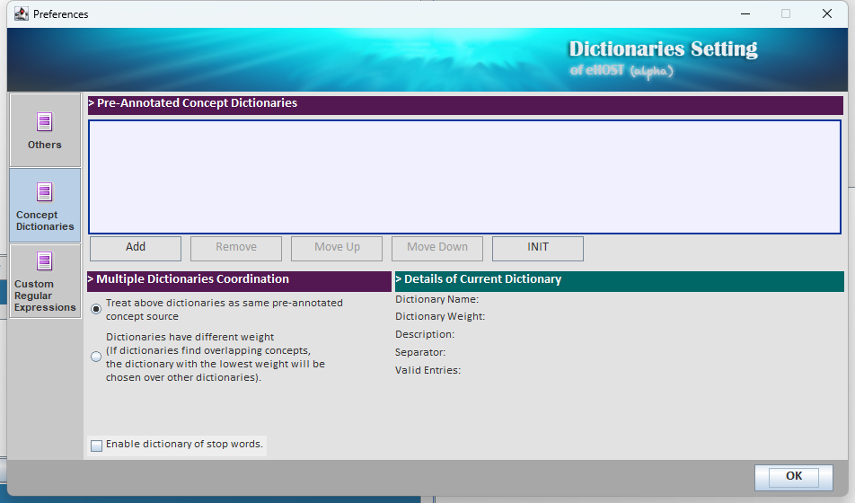
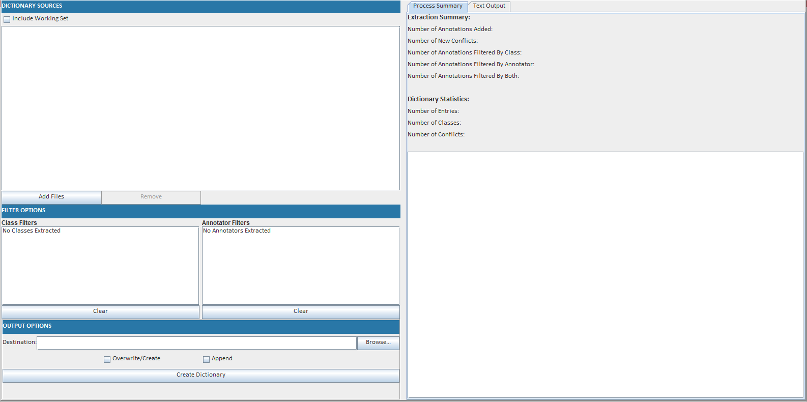

# 4. Beyond Manual Annotation

## 4.1 Generate Pre-annotations Using a Custom Dictionary

Manual annotation is slow. If you already know most of the terms you are looking for, eHOST can go
through the corpus first and create annotations for you; annotators then only review, correct and
extend them. eHOST calls this **NLP Assisted Annotation**.

> Pre-annotations are ordinary annotations. They can be edited or deleted like anything else, and they
> are written with the annotator name **`eHOST`**, so machine output is easy to tell apart from human
> work — including in IAA reports, where `eHOST` shows up as just another annotator.

### The NLP Assisted panel

Click **NLP Assisted** in the toolbar.



The panel is a small pipeline diagram, read left to right:

| Box | Purpose |
|---|---|
| **Using custom regular expressions** | Built-in patterns for *Date & Time* and *SSN* — see [4.2](4.2-Generate-Pre-annotations-using-Regular-Expression.md) |
| **Searching / Using existing dictionaries** | Dictionary-based term lookup (this page) |
| **Search Terms / Using custom regular expressions** | Your own patterns from `customre.lib` — see [4.2](4.2-Generate-Pre-annotations-using-Regular-Expression.md) |
| **Experiencer / Temporality / Assertion** | ConText post-processing of whatever was found — see [4.3](4.3-ConTEXT-algorithm.md) |
| **Set Output Directory** | Where the generated `.knowtator.xml` files are written |
| **Start** | Runs the pipeline over the loaded documents |

### Choosing a dictionary

Tick **Using existing dictionaries**, then click **Configure Dictionaries**. (The same screen is
reachable from the **Dictionary Setting** toolbar button, under the *Concept Dictionaries* tab.)



* **Add** registers a dictionary file. **Remove** unregisters it — the file itself is not deleted.
* **Move Up / Move Down** set the order dictionaries are consulted in.
* **Details of Current Dictionary** shows the name, weight, description, separator and how many valid
  entries eHOST was able to load. Check *Valid Entries* after adding a dictionary: if it is 0 or much
  lower than expected, the separator is probably wrong.
* **Multiple Dictionaries Coordination** decides what happens when two dictionaries match overlapping
  text:
  * *Treat above dictionaries as same pre-annotated concept source* — all dictionaries are equal.
  * *Dictionaries have different weight* — the dictionary with the **lowest** weight wins.
* **Enable dictionary of stop words** filters out entries that match the stop-word list
  (`phrases_invalid.txt`) so that very common phrases do not flood the corpus with annotations.

### Dictionary file format

A dictionary is a plain text file with **one entry per line and two columns**:

```
<term to look for><separator><class name or comment>
```

The separator is whatever you configured for that dictionary (a tab, `|`, `::`, and so on) — it just
must not occur inside the terms themselves. For example, with `|` as the separator:

```
myocardial infarction|Diagnosis
heart attack|Diagnosis
MI|Diagnosis
```

Lines whose first column is empty are skipped.

### Speed modes

| Mode | Use when | Notes |
|---|---|---|
| **Normal Speed** | Small to medium dictionaries | Full pipeline; ConText attributes are available |
| **Quick Extraction** | Dictionaries above roughly 1 million records | Term extraction only — the Experiencer, Temporality and Assertion checkboxes are **disabled** in this mode |

### Running it

1. Load the documents you want pre-annotated (see [1.4 Load Documents](1.4_Load-Documents.md)).
2. Tick the sources you want (dictionaries, built-in patterns, custom patterns).
3. Optionally tick the ConText attributes.
4. Click **Set Output Directory** and choose where the generated annotation files should go.
5. Click **Start**.

Progress and any load errors are reported in the log panel. When the run finishes, open the project in
the Result Editor to review the generated annotations.

### Building a dictionary from annotations you already have

The **Dictionary Manager** toolbar button does the reverse: it reads existing `.knowtator.xml`
annotation files and writes out a dictionary of the terms that were annotated in them.



1. **Add Files** — pick the annotation files to harvest, or tick **Include Working Set** to use the
   documents currently loaded.
2. **Filter Options** — restrict the harvest to certain classes and/or certain annotators, so you can,
   for example, build a dictionary only from the adjudicated gold standard.
3. **Output Options** — choose a destination file and whether to **Overwrite/Create** or **Append**.
4. **Create Dictionary**.

The *Process Summary* panel reports how many annotations were added, how many were filtered out, and
how many entries, classes and conflicts the resulting dictionary has. A *conflict* is the same term
mapped to two different classes; review those before using the dictionary for pre-annotation.

This makes a useful bootstrap loop: annotate a small sample by hand, harvest a dictionary from it,
pre-annotate the rest of the corpus, then correct.
