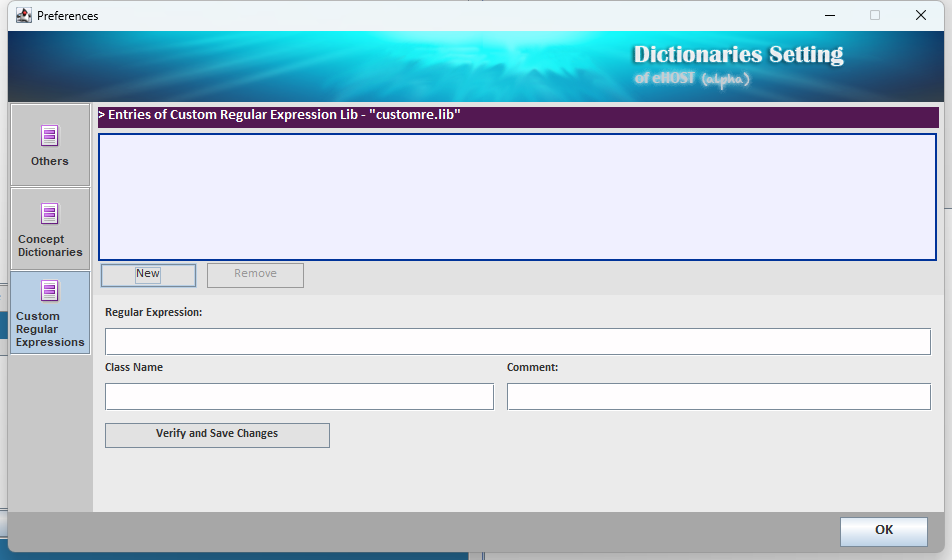

## 4.2 Generate Pre-annotations Using Regular Expressions

Dictionaries are good for terms you can list. For things that follow a *pattern* — dates, identifiers,
measurements, dosages — a regular expression is a better fit. eHOST can apply both in the same run.

Regular expressions come from two places:

| Source | Where it lives | Configured in |
|---|---|---|
| **Built-in patterns** | Compiled into eHOST | The *Using custom regular expressions* box of the NLP Assisted panel |
| **Your own patterns** | `customre.lib` in eHOST's working directory | **Dictionary Setting → Custom Regular Expressions** |

### Built-in patterns

In the **NLP Assisted** panel, tick **Using custom regular expressions** and then whichever built-in
patterns you need:

* **Date & Time**
* **SSN** (US Social Security Numbers)


These are handy for de-identification work — the **Pin Extractor** toolbar button uses the same idea
for personally identifying numbers.

### Writing your own patterns

Click **Dictionary Setting** in the toolbar, then open the **Custom Regular Expressions** tab. The list
shows the entries currently in `customre.lib`. Click **New** to add one.



An entry has three fields:

| Field | Meaning |
|---|---|
| **Regular Expression** | A Java regular expression. Matching is **case-insensitive**. |
| **Class Name** | The annotation class assigned to every match. It should already exist in your schema — see [1.5.1 Define Classes](1.5.1_Define_Classes.md) |
| **Comment** | A free-text note describing the pattern; stored with the entry |

**Verify and Save Changes** compiles the expression before storing it, so a typo is reported
immediately instead of failing silently in the middle of a run. All three fields must be non-empty or
the entry is dropped when the library is reloaded.

### The `customre.lib` file

Entries are stored one per line, **tab separated**, in eHOST's working directory:

```
<regular expression>\t<class name>\t<comment>
```

For example:

```
\d{1,3}\s?mg	Dosage	numeric dose in milligrams
(?:BP|blood pressure)\s*\d{2,3}/\d{2,3}	VitalSign	blood pressure reading
```

You can edit the file directly if you prefer, but going through the dialog gets you the syntax check.
Because the file is shared by every project, patterns you add are available everywhere.

### Applying the patterns

1. In the **NLP Assisted** panel tick **Search Terms — Using custom regular expressions**.
2. Optionally also tick a dictionary source and/or the built-in patterns; they all run in one pass.
3. Click **Set Output Directory**, then **Start**.

### Tips

* Anchor patterns loosely. eHOST feeds sentences to the matcher, so `^`/`$` rarely behave the way you
  expect.
* Test on one document first — a greedy pattern can create thousands of annotations very quickly.
* Because matching is case-insensitive, do not add `(?i)` or separate upper/lower-case variants.
* Escape backslashes as Java expects them (`\\d` in Java source is `\d` in the dialog — type what you
  would type in a regex tester, not what you would type in Java code).
